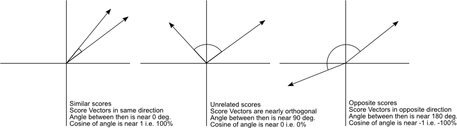
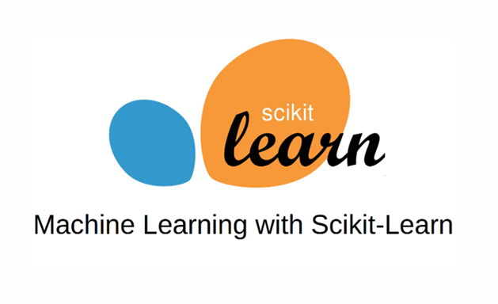

# Recomendador de CVS

## De que trata el proyecto?
Este sistema facilita el trabajo a los reclutadores a la hora de elegir los mejores cv's vinculados con una determinada busqueda.
En pocas palabras el modelo recibe un input el cual puede ser nombre de tecnologias, estudios, ciudad, etc y el mismo da como ouput los mejores matcheos.

## Como funciona este modelo?

El sistema consiste en dos modelos diferentes uno desarrollado desde 0 y otro que usa elasticsearch y sus metodos propios de matcheo.
El primer metodo utiliza una tecnica matematica llamada similitud coseno la cual es capaz de comparar vectores y devolver la similitud que existen entre ambos.

De esta manera el modelo puede iterar en los cvs y comparar el vector origen (input texto) con los cvs disponibles. Luego de terminar se ordenan los que tengan mejor clasificaciones y podemos obtener un top n de los mejores candidatos.

El modelo de elastic search utiliza mecanismos propios de la base de datos en cuestion, mientras que el primer modelo puede ser mas preciso este ultimo es mas rapido ya que cuenta con optimizaciones internas de elastic.

## Algunos datos del sistema

- Basado en microservicios
- Dockerizacion
- Machine Learning Tradicional basado en distancias
- Embeddings adhoc
- Preprocesamiento de texto

## Tecnologias utilizadas

